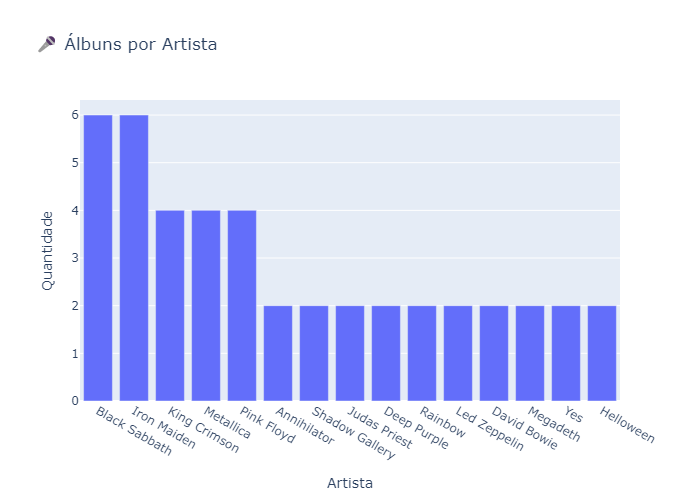

# 🎵 Music Album System Project

Sistema completo de gerenciamento e análise de álbuns musicais com SQLite, Streamlit e Spotify API.

## 📦 Funcionalidades

- Buscar e cadastrar álbuns diretamente do Spotify
- Marcar como favorito ⭐
- Filtrar, ordenar, remover e editar álbuns
- Sortear álbum aleatório
- Análises e gráficos com Pandas e Plotly
- Dashboard com Streamlit
- Testes automatizados com Pytest + cobertura com pytest-cov

## 🚀 Como Executar

### 1. Clone o repositório

```bash
git clone https://github.com/FilipeMadeira13/music-album-system-project.git
cd music-album-system-project
```

### 2. Instale as dependências

```bash
poetry install --no-root
```

### 3. Configure as variáveis de ambiente

Crie um arquivo .env com:

```env
SPOTIPY_CLIENT_ID=your_spotify_client_id
SPOTIPY_CLIENT_SECRET=your_spotify_client_secret
```

Você pode obter essas credenciais em [developer.spotify.com](https://developer.spotify.com).

### 4. Execute o sistema via terminal

```bash
python main.py
```

### 5. Execute o dashboard com Streamlit

```bash
streamlit run app.py
```

## 🧪 Testes


Execute os testes com cobertura:

```bash
poetry run pytest --cov=src --cov-report=term-missing

```

## 📊 Exemplos de Gráficos

**Álbuns por Gênero**  


**Álbuns por Década**  


**Álbuns por Artista**  


**Exemplo de Álbum Buscado pelo Spotify**  


## 🛠️ Tecnologias Utilizadas

- Python 3.11+
- SQLite
- Spotipy
- Streamlit
- Pandas
- Plotly
- Pytest + Coverage
- Pre-commit (black, isort)

## 👨‍💻 Autor

Filipe Madeira

- 📧 <a href="mailto:cfilipemadeira@gmail.com">cfilipemadeira@gmail.com</a>
- 🔗 [GitHub](https://github.com/FilipeMadeira13)
- 🔗 [LinkedIn](https://www.linkedin.com/in/carlos-filipe-madeira-de-souza-16211922a/)

## 📜 Licença

Este projeto está licenciado sob a [MIT License](https://opensource.org/licenses/MIT).
