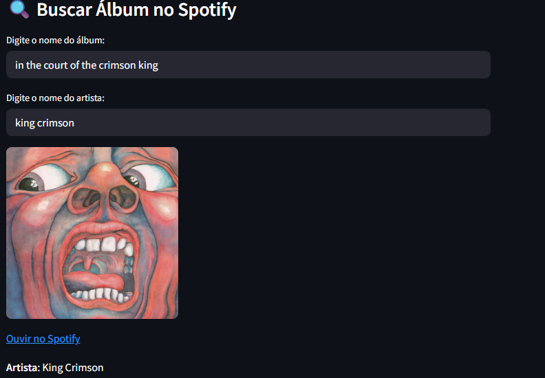

# 🎵 Music Album System Project

Sistema completo de análise de álbuns musicais com SQLite, Streamlit e integração com a API do Spotify.

---

## 📊 Visão Geral

Este projeto permite:

- Cadastro e gerenciamento de álbuns (nome, artista, gênero, ano)
- Armazenamento em banco de dados SQLite
- Análises e visualizações por gênero, artista, ano e década
- Integração com a API do Spotify para enriquecer os dados
- Interface interativa via terminal e dashboard com Streamlit

---

## 🌐 Tecnologias Utilizadas

- Python 3.11+
- SQLite3
- Streamlit
- Spotipy (API Spotify)
- Pandas
- Plotly
- dotenv

---

## ⚖️ Funcionalidades

### Terminal (main.py)

- [x] Adicionar, listar, remover e filtrar álbuns
- [x] Atualizar um álbum com dados reais da API do Spotify
- [x] Validar duplicidade por nome **e artista**

### Dashboard (app.py)

- [x] Gráficos por gênero, artista e década
- [x] Filtro interativo por intervalo de anos
- [x] Busca de álbuns com imagem e link direto para o Spotify

---

## ⚖️ Como Usar o Projeto

### 1. Clone o repositório

```bash
git clone https://github.com/seu-usuario/music-album-system-project.git
cd music-album-system-project
```

### 2. Instale as dependências

```bash
poetry install --no-root
```

### 3. Configure as variáveis de ambiente

Crie um arquivo `.env` com:

```env
SPOTIPY_CLIENT_ID=xxxxxx
SPOTIPY_CLIENT_SECRET=yyyyyy
```

### 4. Execute o terminal

```bash
python main.py
```

### 5. Rode o dashboard Streamlit

```bash
streamlit run app.py
```

---

## 📈 Exemplo de Análise no Dashboard




---

## 🚀 Roadmap Futuro

- [ ] Marcar álbuns favoritos
- [ ] Exportar relatórios em CSV
- [ ] Adicionar playlist automática com base nos álbuns favoritos

---

## 🎓 Autor

**Filipe Madeira**

---

## 🔗 Contribuições

Pull requests são bem-vindos. Para mudanças maiores, abra uma issue primeiro.

---

## ✅ Licença

Este projeto está licenciado sob a MIT License.
