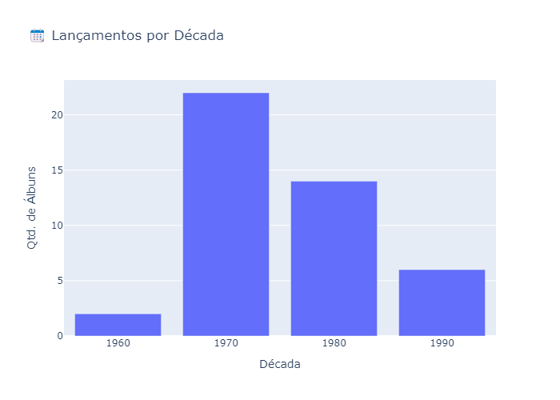
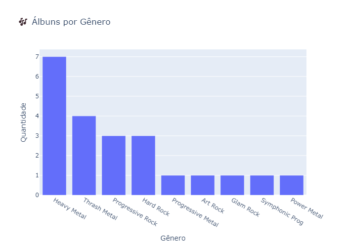

# 🎵 Projeto de Análise de Álbuns Musicais

Este projeto coleta, organiza e analisa dados de álbuns musicais com foco em visualização interativa e estatísticas por gênero, artista e década.

## 📌 Tecnologias utilizadas

- Python 3.11
- Pandas
- Plotly
- JSON (armazenamento)
- Jupyter Notebook

## 🧱 Estrutura do Projeto

```
src/ # Módulos Python (CRUD, análise, visualização)
data/ # Arquivo albums.json
notebooks/ # Análises exploratórias
main.py # Aplicação interativa em terminal
```

## 📊 Funcionalidades

- Adicionar, listar, filtrar e remover álbuns
- Armazenamento em JSON
- Estatísticas descritivas com Pandas
- Visualização com Plotly (gênero, artista, ano, década)

## 📷 Exemplos

### Lançamentos por Década



### Álbuns por Gênero



## 🛠️ Como executar

```bash
git clone https://github.com/FilipeMadeira13/music-album-system-project.git
cd music-album-system-project
poetry install --no-root
python main.py
```

## 📈 Para análise via notebook

```
Abra o notebooks/exploratory_analysis.ipynb
```

## 🚀 Próximos passos

- Migração para SQLite

- Dashboard com Streamlit

- Integração com API do Spotify

Feito por Filipe Madeira – 2025
